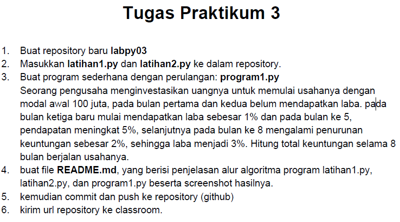
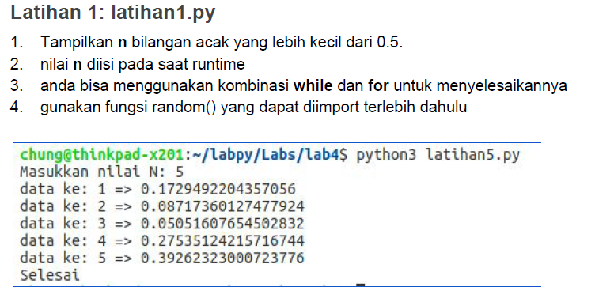
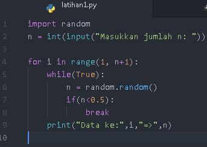
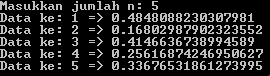
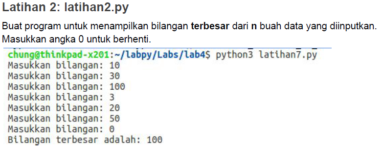
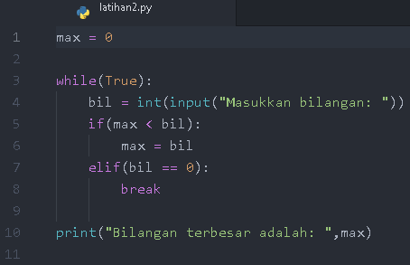
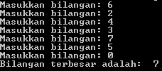
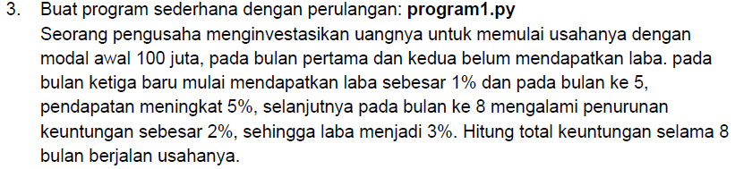
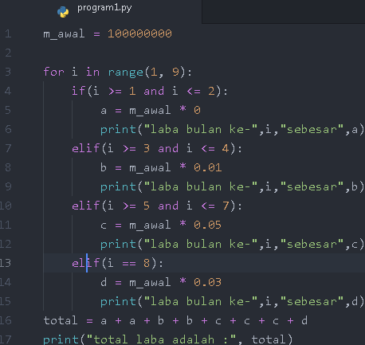

# TUGAS PRAKTIKUM 3

## SOAL

### LATIHAN1

  - Buka text editor, kemudian salin kode berikut

        import random
        n = int(input("Masukkan jumlah n: "))

        for i in range(1, n+1):
            while(True):
                n = random.random()
                if(n<0.5):
                    break
            print("Data ke:",i,"=>",n)

  - Simpan dengan nama `latihan1.py`, kemudian jalankan program tersebut. Maka akan menampilkan output sebagai berikut

### Penjelasan
  - Pada baris pertama program `latihan1.py`, tertulis _`import random`_ yang berarti kita meng-impor modul/ _library_ bawaan dari python bernama **random**. Modul ini berisi bilangan acak, dengan bentuk **float**.

  - Baris ke-3 mendeklarasikan _`n`_ sebagai variabel untuk menyimpan nilai/ jumlah yang akan kita masukkan nanti. Dan _`int`_ merubah bentuknya yang sebelumnya _string_ menjadi _integer_.

  - Baris ke-4 _`for`_ merupakan perulangan, dan _`i`_ untuk menampung indeks. _`range(1, n+1)`_ sebagai list perhitungan, dimulai dari `1`, dan diakhiri dengan jumlah yang kita masukkan pada variabel `n`.

  - Baris ke-5 _`while`_. Selama kondisi benar / _True_ maka akan terus diulang.

  - Baris ke-6 variabel `n = random.random()` menyimpan bilangan acak.

  - Di baris ke-7, klausa `if` sebagai pemilihan kondisi dan `break` (baris-8) untuk berhenti. _"Jika nilai `n` kurang dari 0.5, maka program berhenti, lalu tampilkan nilai `n`"_.(pada baris ke-9)

### LATIHAN2

- Buka text editor, kemudian salin kode berikut

      max = 0

      while(True):
          bil = int(input("Masukkan bilangan: "))
          if(max < bil):
              max = bil
          elif(bil == 0):
              break

      print("Bilangan terbesar adalah: ",max)

  - Simpan dengan nama `latihan2.py`, kemudian jalankan program tersebut. Maka akan menampilkan output sebagai berikut

### Penjelasan
  - Baris ke-1, mendeklarasikan variabel `max` yang nilainya **0**.

  - Baris ke-3 _`while`_. Selama kondisi benar / _True_ maka akan terus diulang.

  - Baris ke-4, mendeklarasikan variabel `bil`, yang membiarkan kita me masukkan bilangan apapun. Dan tampilkan dalam bentuk _integer_.

  - Baris ke-5 klausa `if` untuk pemilihan kondisi. _"jika nilai `max` kurang dari `bil` (yang diinputkan), maka jadikan variabel `max` diisi dengan nilai `bil`"_. (baris ke-6)

  - Baris ke-7 klausa `elif` untuk pemilihan kondisi selanjutnya. _jika nilai `bil`(yang diinputkan) sama dengan **0**, maka berhentikan program_. (baris ke-8)

  - Baris ke-10 `print` akan menampilkan bilangan terbesar dari yang diinputkan, atau `max`.

### PROGRAM1

  - Buka text editor, kemudian salin kode berikut

        m_awal = 100000000

        for i in range(1, 9):
            if(i >= 1 and i <= 2):
                a = m_awal * 0
                print("laba bulan ke-",i,"sebesar",a)
            elif(i >= 3 and i <= 4):
                b = m_awal * 0.01
                print("laba bulan ke-",i,"sebesar",b)
            elif(i >= 5 and i <= 7):
                c = m_awal * 0.05
                print("laba bulan ke-",i,"sebesar",c)
            elif(i == 8):
                d = m_awal * 0.03
                print("laba bulan ke-",i,"sebesar",d)
        total = a + a + b + b + c + c + c + d
        print("total laba adalah :", total)

  - Simpan dengan nama `program1.py`, kemudian jalankan program tersebut. Maka akan menampilkan output sebagai berikut

### Penjelasan

  - Baris ke-1, mendeklarasikan variabel `m_awal` berisi nilai **100000000**

  - Baris ke-3 `for` untuk perulangan, `i` untuk menyimpan indeks antara **1** sampai dengan **8**.

  - Baris ke-4 klausa `if` untuk pemilihan kondisi. _"Jika nilai `i` lebih besar atau sama dengan 1, dan lebih kecil atau sama dengan 2. Deklarasikan variabel baru, yaitu `a`"_. (Baris ke-5) Variabel `a` berisi nilai variabel `m_awal` dikali dengan 0. (Baris ke-6) Dan perintah `print` akan mencetak ke layar.

  - Baris ke-7 klausa `elif` untuk pemilihan kondisi selanjutnya. _"Jika nilai `i` lebih besar atau sama dengan 3, dan lebih kecil atau sama dengan 4. Deklarasikan variabel baru, yaitu `b`"_. (Baris ke-8) Variabel `b` berisi nilai variabel `m_awal` dikali dengan 0.01. (Baris ke-9) Dan perintah `print` akan mencetak ke layar.

  - Baris ke-10 klausa `elif` untuk pemilihan kondisi selanjutnya. _"Jika nilai `i` lebih besar atau sama dengan 5, dan lebih kecil atau sama dengan 7. Deklarasikan variabel baru, yaitu `c`"_. (Baris ke-11) Variabel `c` berisi nilai variabel `m_awal` dikali dengan 0.05. (Baris ke-12) Dan perintah `print` akan mencetak ke layar.

  - Baris ke-13 klausa `elif` untuk pemilihan kondisi selanjutnya. _"Jika nilai `i` sama dengan 8. Deklarasikan variabel baru, yaitu `d`"_. (Baris ke-14) Variabel `d` berisi nilai variabel `m_awal` dikali dengan 0.03. (Baris ke-15) Dan perintah `print` akan mencetak ke layar.

  - Baris ke-16, variabel `total` akan menjumlah nilai dari variabel `a`,`b`,`c`, dan `d`.

  - Baris ke-17, perintah `print` akan menctak nilai pada variabel `total` ke layar.
